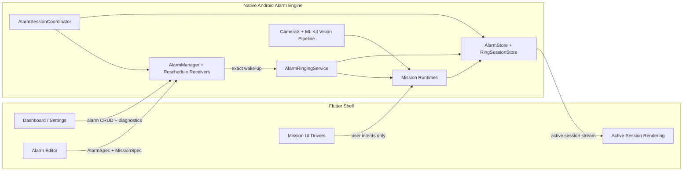

# NeoAlarm

Android-first, local-first, open source alarm app built with Flutter and a native Android alarm engine.

NeoAlarm exists to provide a mission-driven alarm experience without ads, subscriptions, cloud dependency, or a fragile "Flutter-only" runtime model. The product surface is Flutter. The alarm-critical behavior is native Android.

> Status: alpha  
> Platform: Android 10+ (`minSdk 29`)  
> Application ID: `dev.neoalarm.app`

## Why NeoAlarm

Most alarm apps are easy to style and hard to trust. NeoAlarm is designed as a reliability product first:

- exact alarm scheduling through Android's native alarm stack
- foreground ringing service that survives Flutter isolate loss
- direct-boot-aware persistence for reboot recovery before first unlock
- mission-based dismissal that is enforced natively, not just visually
- fully local-first behavior with no backend and no account requirement

## Current Feature Set

Implemented today:

- multiple one-time and repeating alarms
- exact scheduling via `AlarmManager.setAlarmClock()`
- native persistence and reschedule on boot, package replace, time change, and timezone change
- foreground ringing service with looping audio, vibration, and full-screen recovery
- snooze duration and max-snooze limits
- active ring-session recovery after process death
- diagnostics and permission repair flows
- math mission with configurable difficulty and problem count
- steps mission with `TYPE_STEP_DETECTOR` progress and cadence filtering
- QR mission backed by a reusable native vision pipeline
- quiet timer sourced from the persisted native timeout deadline
- minified release builds, CodeQL, dependency review, and release artifact workflows

## Product Principles

- Local-first: no backend, no account, no ads, no subscription model
- Native authority: dismissal, ringing, scheduling, and recovery stay on Android-native code
- Honest anti-cheat: mission silence is conditional and enforced by native state
- Extensible architecture: new missions should plug into the platform without rewriting the scheduler

## Architecture

NeoAlarm is intentionally split into two execution domains.



### Mission Execution Boundary

This boundary is the most important architectural rule in the project.

| Concern | Flutter | Native Android |
| --- | --- | --- |
| Mission configuration | Owns editor UI and user-facing summaries | Mirrors config for native execution |
| Mission rendering | Owns active mission screens and input widgets | Does not render Flutter UI |
| Mission runtime state | Reads snapshots only | Owns authoritative runtime state and persistence |
| Mission progress validation | Never authoritative | Validates progress and completion |
| Quiet timer | Displays native deadline | Owns and updates the real deadline |
| Dismissal authority | Sends intents only | Decides whether dismissal is allowed |
| Recovery after process death | Re-renders current session | Restores session and keeps enforcement alive |

In practical terms:

- Flutter can configure a mission.
- Flutter can render a mission.
- Flutter can send mission input back to native code.
- Flutter cannot decide that a mission is complete.
- Flutter cannot dismiss a mission alarm on its own.

That keeps mission behavior reliable even if the app process is reclaimed or the Flutter route stack is lost.

## Reliability Model

NeoAlarm is built around a persisted active session with three states:

- `ringing`
- `mission_active`
- `snoozed`

Key guarantees:

- alarm delivery does not depend on a live Flutter isolate
- ringing starts natively before any mission UI is required
- mission-active silence is temporary and enforced by native inactivity timers
- reboot recovery works from device-protected storage, including `LOCKED_BOOT_COMPLETED`
- lock-screen/full-screen alarm UI is authorized by persisted active-session state, not by a forgeable intent action

For the full model, read [docs/architecture/active-session-lifecycle.md](docs/architecture/active-session-lifecycle.md).

## Security And Privacy Posture

NeoAlarm is local-first, but it still controls high-impact device behavior. Current posture:

- no backend dependency
- no account system
- no telemetry dependency
- Android auto-backup disabled for MVP
- device-protected storage only for alarm-critical state
- exported reschedule surfaces narrowed to expected system actions
- release builds minified and shrink-resources enabled

Security and release decisions are tracked in the ADR set under [docs/adr](docs/adr).

## Tech Stack

- Flutter `3.41.x`
- Dart `3.11.x`
- Riverpod for app-side state wiring
- Kotlin on Android for the alarm engine
- `AlarmManager.setAlarmClock()` for exact scheduling
- CameraX + ML Kit for the QR mission pipeline

## Getting Started

### Prerequisites

- Flutter `3.41.x` or newer on the stable channel
- Android SDK configured locally
- Java 17-compatible Android build environment
- a physical Android device is strongly recommended for real validation

### Local Setup

```bash
flutter pub get
flutter analyze
flutter test
```

### Run On A Device

```bash
flutter run -d <device-id>
```

### Build APKs

Debug:

```bash
flutter build apk --debug
```

Release:

```bash
flutter build apk --release
```

## Release Signing

Local release signing is driven by [`android/key.properties.example`](android/key.properties.example).

To use a real signing key:

1. Copy `android/key.properties.example` to `android/key.properties`
2. Point `storeFile` at your keystore
3. Fill in:
   - `storePassword`
   - `keyAlias`
   - `keyPassword`

If `android/key.properties` is absent, Gradle falls back to debug signing so CI and local verification builds still work.

Optional GitHub Actions secrets for signed release artifacts:

- `ANDROID_SIGNING_KEYSTORE_BASE64`
- `ANDROID_KEY_ALIAS`
- `ANDROID_KEYSTORE_PASSWORD`
- `ANDROID_KEY_PASSWORD`

## CI And Release Automation

GitHub Actions currently provides:

- `Android CI`
  - `flutter analyze`
  - `flutter test`
  - debug APK build
  - artifact upload
- `CodeQL`
  - source-level SAST for Android code and workflow code
- `Dependency Review`
  - dependency-risk / CVE review on pull requests
- `Release APK`
  - release APK build and GitHub release publishing on `v*` tags

Release builds are not considered verified until the minified APK has been installed and smoke-tested on a real device.

## Testing Strategy

NeoAlarm uses a layered test model:

- unit tests for recurrence, serialization, mission rules, and config validation
- Flutter/native boundary tests for session shape and runtime contracts
- CI APK builds and release verification
- real-device manual testing for alarm, lock-screen, Doze, reboot, and OEM-specific behavior

The full test model is documented in [docs/testing/test-strategy.md](docs/testing/test-strategy.md).

## Repository Map

- [docs/README.md](docs/README.md): documentation index
- [docs/architecture/overview.md](docs/architecture/overview.md): stable system model
- [docs/architecture/engineering-story.md](docs/architecture/engineering-story.md): engineering rationale
- [docs/architecture/active-session-lifecycle.md](docs/architecture/active-session-lifecycle.md): authoritative alarm session lifecycle
- [docs/contributing/mission-authoring.md](docs/contributing/mission-authoring.md): how to add missions safely
- [docs/planning/overall-plan.md](docs/planning/overall-plan.md): implementation roadmap
- [docs/planning/sprint-plan.md](docs/planning/sprint-plan.md): sprint breakdown
- [docs/adr/README.md](docs/adr/README.md): architecture decision records

## Contributing

Before making behavior or architecture changes, read:

- [docs/contributing/engineering-standards.md](docs/contributing/engineering-standards.md)
- [docs/architecture/overview.md](docs/architecture/overview.md)
- [docs/architecture/active-session-lifecycle.md](docs/architecture/active-session-lifecycle.md)

If your change alters subsystem ownership, mission contracts, camera ownership, scheduling semantics, or release/security policy, add or update an ADR.

## Current Non-Goals

Not currently in scope:

- iOS support
- cloud sync
- server-side analytics
- account system
- guaranteed blocking of the stock Android power menu

## Asset Attribution

- Launcher icon source: [Alarm icons created by justicon - Flaticon](https://www.flaticon.com/free-icons/alarm)

## Documentation

This repository treats documentation as part of the engineering surface, not cleanup. If you change system behavior, update the docs in the same patch.
