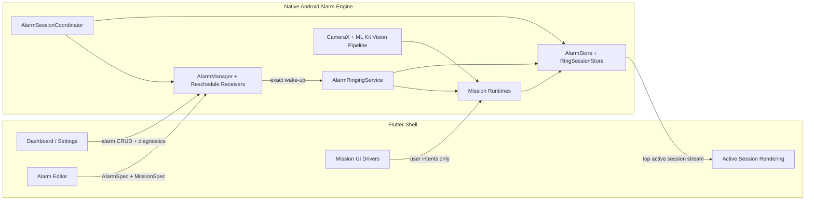

# NeoAlarm

[](https://github.com/NFRohan/NeoAlarm/releases/latest)
[](https://github.com/NFRohan/NeoAlarm/actions/workflows/android.yml)
[](https://github.com/NFRohan/NeoAlarm/actions/workflows/codeql.yml)
[](LICENSE)


<p align="center">
  
</p>

Android-first, local-first, open source alarm app built with Flutter and a native Android alarm engine.

NeoAlarm exists to provide a mission-driven alarm experience without ads, subscriptions, cloud dependency, or a fragile "Flutter-only" runtime model. The product surface is Flutter. The alarm-critical behavior is native Android.

> Status: alpha  
> Platform: Android 10+ (`minSdk 29`)  
> Application ID: `dev.neoalarm.app`

## Why NeoAlarm

Most alarm apps are easy to style and hard to trust. NeoAlarm is designed as a reliability product first:

- exact alarm scheduling through Android's native alarm stack
- foreground ringing service that survives Flutter isolate loss
- direct-boot-aware persistence for reboot recovery before first unlock
- mission-based dismissal that is enforced natively, not just visually
- fully local-first behavior with no backend and no account requirement

## Current Feature Set

Implemented today:

- multiple one-time and repeating alarms
- exact scheduling via `AlarmManager.setAlarmClock()`
- native persistence and reschedule on boot, package replace, time change, and timezone change
- foreground ringing service with looping audio, vibration, and full-screen recovery
- `Skip next` for repeating alarms without disabling the full schedule
- per-alarm `Volume ramp up` toggle
- per-alarm `Extra loud mode` with conservative speaker-only boost
- reusable custom tone imports with per-alarm tone selection
- snooze duration and max-snooze limits
- active ring-session recovery after process death
- diagnostics and permission repair flows
- first-run onboarding flow for exact alarms, notifications, and battery optimization
- math mission with configurable difficulty and problem count
- steps mission with `TYPE_STEP_DETECTOR` progress and cadence filtering
- QR mission backed by a reusable native vision pipeline
- quiet timer sourced from the persisted native timeout deadline
- `MediaPlayer`-based alarm playback with a bundled direct-boot-safe fallback tone for reboot-before-unlock alarms
- custom tone validation with MIME checks, a 15 MB import cap, and fallback-to-warning behavior when a tone source disappears

Current playback note:

- `Volume ramp up` and `Extra loud mode` are independent per-alarm options
- when both are enabled, the player ramps upward normally and the conservative speaker-only loudness boost is applied on top of that playback session
- minified release builds, CodeQL, dependency review, and release artifact workflows

## Screenshots

<table>
  <tr>
    <td align="center"><br><sub>Home · Light</sub></td>
    <td align="center"><br><sub>Settings · Dark</sub></td>
    <td align="center"><br><sub>Home · Dark</sub></td>
  </tr>
  <tr>
    <td align="center"><br><sub>Alarm Editor</sub></td>
    <td align="center"><br><sub>Time Picker · Dark</sub></td>
    <td align="center"><br><sub>Time Picker · Light</sub></td>
  </tr>
  <tr>
    <td align="center"><br><sub>Active Alarm</sub></td>
    <td align="center"><br><sub>Math Mission</sub></td>
    <td align="center"><br><sub>Steps Mission</sub></td>
  </tr>
  <tr>
    <td align="center"><br><sub>QR Mission</sub></td>
    <td align="center"><br><sub>Set QR Target</sub></td>
    <td></td>
  </tr>
</table>

## Product Principles

- Local-first: no backend, no account, no ads, no subscription model
- Native authority: dismissal, ringing, scheduling, and recovery stay on Android-native code
- Honest anti-cheat: mission silence is conditional and enforced by native state
- Permission discipline: first-run onboarding covers alarm-critical Android controls, while mission-specific permissions stay contextual
- Extensible architecture: new missions should plug into the platform without rewriting the scheduler

## Architecture

NeoAlarm is intentionally split into two execution domains.



### Mission Execution Boundary

This boundary is the most important architectural rule in the project.

| Concern | Flutter | Native Android |
| --- | --- | --- |
| Mission configuration | Owns editor UI and user-facing summaries | Mirrors config for native execution |
| Mission rendering | Owns active mission screens and input widgets | Does not render Flutter UI |
| Mission runtime state | Reads snapshots only | Owns authoritative runtime state and persistence |
| Mission progress validation | Never authoritative | Validates progress and completion |
| Quiet timer | Displays native deadline | Owns and updates the real deadline |
| Dismissal authority | Sends intents only | Decides whether dismissal is allowed |
| Recovery after process death | Re-renders current session | Restores session and keeps enforcement alive |

In practical terms:

- Flutter can configure a mission.
- Flutter can render a mission.
- Flutter can send mission input back to native code.
- Flutter cannot decide that a mission is complete.
- Flutter cannot dismiss a mission alarm on its own.

That keeps mission behavior reliable even if the app process is reclaimed or the Flutter route stack is lost.

## Reliability Model

NeoAlarm is built around a persisted stack of live ring sessions. Flutter renders only the current top active session, but native Android preserves interrupted sessions beneath it so overlapping alarms can preempt safely and then resume.

Each live session still uses the same three persisted states:

- `ringing`
- `mission_active`
- `snoozed`

Key guarantees:

- alarm delivery does not depend on a live Flutter isolate
- ringing starts natively before any mission UI is required
- mission-active silence is temporary and enforced by native inactivity timers
- reboot recovery works from device-protected storage, including `LOCKED_BOOT_COMPLETED`
- reboot and Doze resilience have both been validated on-device
- lock-screen/full-screen alarm UI is authorized by persisted active-session state, not by a forgeable intent action

For the full model, read [docs/architecture/active-session-lifecycle.md](docs/architecture/active-session-lifecycle.md).

## Security And Privacy Posture

NeoAlarm is local-first, but it still controls high-impact device behavior. Current posture:

- no backend dependency
- no account system
- no telemetry dependency
- Android auto-backup disabled for MVP
- device-protected storage only for alarm-critical state
- exported reschedule surfaces narrowed to expected system actions
- release builds minified and shrink-resources enabled

Security and release decisions are tracked in the ADR set under [docs/adr](docs/adr).

## Tech Stack

- Flutter `3.41.x`
- Dart `3.11.x`
- Riverpod for app-side state wiring
- Kotlin on Android for the alarm engine
- `AlarmManager.setAlarmClock()` for exact scheduling
- `MediaPlayer` for controllable alarm playback and per-instance ramping
- CameraX + ML Kit for the QR mission pipeline

## Getting Started

### Prerequisites

- Flutter `3.41.x` or newer on the stable channel
- Android SDK configured locally
- Java 17-compatible Android build environment
- a physical Android device is strongly recommended for real validation

### Local Setup

```bash
flutter pub get
flutter analyze
flutter test
```

### Run On A Device

```bash
flutter run -d <device-id>
```

### Build APKs

Debug:

```bash
flutter build apk --debug
```

Release:

```bash
flutter build apk --release
```

## Release Signing

Local release signing is driven by [`android/key.properties.example`](android/key.properties.example).

To use a real signing key:

1. Copy `android/key.properties.example` to `android/key.properties`
2. Point `storeFile` at your keystore
3. Fill in:
   - `storePassword`
   - `keyAlias`
   - `keyPassword`

If `android/key.properties` is absent, Gradle falls back to debug signing so CI and local verification builds still work.

Current local release setup:

- the repository now supports a real locally generated release keystore at `android/app/release-keystore.jks`
- live signing values are kept only in `android/key.properties`, which is ignored by Git
- a base64 export suitable for GitHub Actions secrets can be generated or stored under `.artifacts/signing`
- public release artifacts should use the real signing path, not the debug-sign fallback

To sync the local signing material into GitHub Actions secrets with the authenticated GitHub CLI:

```powershell
powershell -ExecutionPolicy Bypass -File scripts/github/sync_android_signing_secrets.ps1
```

Optional GitHub Actions secrets for signed release artifacts:

- `ANDROID_SIGNING_KEYSTORE_BASE64`
- `ANDROID_KEY_ALIAS`
- `ANDROID_KEYSTORE_PASSWORD`
- `ANDROID_KEY_PASSWORD`

## CI And Release Automation

GitHub Actions currently provides:

- `Android CI`
  - `flutter analyze`
  - `flutter test`
  - pull requests: debug APK build + debug artifact upload
  - `main` and manual runs: release verification APK build + artifact upload
- `CodeQL`
  - source-level SAST for Android code and workflow code
- `Dependency Review`
  - dependency-risk / CVE review on pull requests
- `Distribute Android Release`
  - signed release APK and app bundle build
  - checksum and build metadata generation
  - GitHub release publishing on `v*` tags
  - manual `workflow_dispatch` distribution for a chosen tag

Release builds are not considered verified until the minified APK has been installed and smoke-tested on a real device.

## Distribution Workflow

There are two supported distribution paths:

- push a tag like `v0.1.0` to trigger the signed release workflow automatically
- run the `Distribute Android Release` workflow manually with a `tag_name`

The distribution workflow requires all four Android signing secrets. Unlike local release verification builds, it fails closed if those secrets are missing.

## Testing Strategy

NeoAlarm uses a layered test model:

- unit tests for recurrence, serialization, mission rules, and config validation
- Flutter/native boundary tests for session shape and runtime contracts
- CI APK builds and release verification
- real-device manual testing for alarm, lock-screen, Doze, reboot, and OEM-specific behavior

The full test model is documented in [docs/testing/test-strategy.md](docs/testing/test-strategy.md).

## Performance Tooling

The repository includes a real Android performance workflow, not just ad hoc `adb` commands:

- Macrobenchmark module in `android/benchmark`
- manual Perfetto capture scripts in `scripts/android`
- dependency audit script for tracing unexpected Android background work back to the Gradle graph

Current notes:

- the benchmark target is a release-like `benchmark` app variant that stays debug-signed for local device installation
- the benchmark variant intentionally skips minification and resource shrinking because the real minified `release` APK is validated separately, while the synthetic benchmark build type needs to stay stable for repeated measurements
- `android:profileable="shell=true"` now lives only in the benchmark target manifest, not in the shipped app manifest
- the shipped app still pins `androidx.profileinstaller`, because profile-guided startup optimization is useful in production and required by the benchmark toolchain
- the current QR stack pulls in ML Kit, which in turn pulls in `com.google.android.datatransport.runtime`; that background work is tracked and documented rather than ignored

See [docs/testing/performance-workflow.md](docs/testing/performance-workflow.md) for the exact commands, outputs, and current baseline numbers.

## Repository Map

- [docs/README.md](docs/README.md): documentation index
- [docs/architecture/overview.md](docs/architecture/overview.md): stable system model
- [docs/architecture/engineering-story.md](docs/architecture/engineering-story.md): engineering rationale
- [docs/architecture/active-session-lifecycle.md](docs/architecture/active-session-lifecycle.md): authoritative alarm session lifecycle
- [docs/contributing/mission-authoring.md](docs/contributing/mission-authoring.md): how to add missions safely
- [docs/testing/performance-workflow.md](docs/testing/performance-workflow.md): Macrobenchmark, Perfetto, and dependency-audit workflow
- [docs/planning/overall-plan.md](docs/planning/overall-plan.md): implementation roadmap
- [docs/planning/sprint-plan.md](docs/planning/sprint-plan.md): sprint breakdown
- [docs/adr/README.md](docs/adr/README.md): architecture decision records
- [`screenshots/`](screenshots): current app screenshots used in repository documentation

## Contributing

Before making behavior or architecture changes, read:

- [docs/contributing/engineering-standards.md](docs/contributing/engineering-standards.md)
- [docs/architecture/overview.md](docs/architecture/overview.md)
- [docs/architecture/active-session-lifecycle.md](docs/architecture/active-session-lifecycle.md)

If your change alters subsystem ownership, mission contracts, camera ownership, scheduling semantics, or release/security policy, add or update an ADR.

## Current Non-Goals

Not currently in scope:

- iOS support
- cloud sync
- server-side analytics
- account system
- guaranteed blocking of the stock Android power menu

## License

NeoAlarm is licensed under [GNU General Public License v3.0](LICENSE).

## Documentation

This repository treats documentation as part of the engineering surface, not cleanup. If you change system behavior, update the docs in the same patch.
